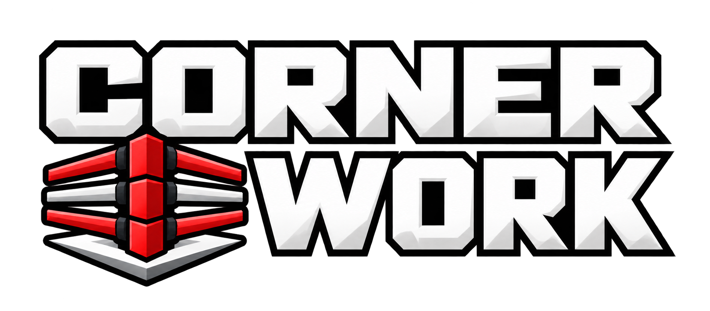

  

  A glove-friendly boxing combo coach and configurable workout timer for heavy bag work, shadowboxing, kickboxing, pad work, and general striking practice.

  <a href="https://cornerwork.ca/"><strong>Open Cornerwork</strong></a>
  ·
  <a href="https://github.com/Aiirik/cornerwork/issues">Report a problem</a>

## About Cornerwork

Cornerwork combines a flexible round timer with spoken, randomized combination coaching. It is designed to remain readable from a distance, easy to control while wearing gloves, and quick to start without requiring an account.

Workouts can be as simple as a few timed rounds or as detailed as a complete training plan with technique filters, round focuses, structured blocks, coaching cues, custom sounds, and saved progress. Cornerwork works in a desktop browser, on mobile, and as an installable Progressive Web App.

## Ways to train

| Workout type | What it does |
| --- | --- |
| **Custom** | Build a workout from scratch by choosing the timing, skill level, techniques, combinations, round focuses, and coaching behavior. |
| **Quick Start** | Answer a few questions about duration, goal, skill, equipment, and training style to generate an editable workout. |
| **Presets** | Start from a ready-made general workout configuration, then adjust it using the normal Cornerwork controls. |
| **Programs** | Follow purpose-built sessions for focus drills, heavy bag work, shadowboxing, foundations, intervals, and fight-style training. |
| **Program Studio** | Create a locked multi-round plan with shared timing and a specific focus for each round. Studio programs can be saved, replayed, shared, and synced. |
| **Endless** | Keep clearing progressively harder levels with no final round. Round length, rest, callout pace, skill, and combination length increase gradually while points track the work called. |

Built-in Programs show their session structure before loading. Completed sessions are tracked individually, and repeatable programs can create a fresh valid variation or replay the exact last-started sequence.

## Workout setup

Cornerwork lets you shape both the timer and the coaching:

- Set the number of rounds, warm-up, round length, rest, and combination frequency.
- Choose **Bag**, **Shadowboxing**, or **General** training.
- Select **Basic**, **Intermediate**, or **Advanced** skill.
- Include or exclude punches, body shots, defense, footwork, kicks, knees, and elbows.
- Adjust combination complexity, repeats, between-combo movement, and unique-round behavior.
- Select the exact combinations Cornerwork may use or create custom combinations.
- Add round focuses and optional 30 or 60-second structured blocks.
- Choose orthodox or southpaw terminology.
- Use number callouts or full technique names.

The combination generator respects the selected skill, complexity, techniques, stance, training mode, allowed-combo list, and active round focus. It avoids immediate duplicates when alternatives are available and keeps Unique Rounds varied until the compatible pool is exhausted.

## Coaching and workout audio

Cornerwork is built to reduce how often you need to look at the screen.

- Spoken combinations with separate speed controls for numbers and words
- Optional coaching reminders and guided beginner cues
- Recovery instructions during rest periods
- Adjustable callout frequency
- Configurable round-start, final-warning, and round-end sounds
- Independent sound selection, volume, pitch, hit count, spacing, and decay controls
- A shared workout volume control that can be adjusted without leaving the timer

Combinations remain hidden until the round begins. The timer waits for the opening announcement and start sound, then begins the normal callout cadence.

## During a workout

The main workout view prioritizes the current phase, countdown, combination, and controls.

- Ready, warm-up, work, rest, and completion phases
- Remaining workout time, combo count, and move count
- Round or level timeline with completed phases clearly marked
- Pause, resume, previous phase, and next phase controls
- Hold-to-restart protection while paused
- Wake Lock support to help keep compatible screens awake
- Standard and Compact layouts
- Adjustable clock font, clock size, and callout size
- Responsive desktop and mobile layouts that keep the clock and controls visible

Endless mode uses the same workout engine and audio controls while adding progressive levels, weighted points, focused levels, and Endless-specific coaching. It has no target score or finish line; pause and hold the main control when you are ready to end the run.

## Saving, sharing, and progress

Cornerwork works without signing in. The browser stores your normal settings and locally created content on the device.

You can:

- Save workout presets with notes and favourites.
- Search, duplicate, load, or delete saved workouts.
- Share workouts using a link or QR code.
- Save and manage Program Studio plans.
- Track workout history, streaks, and completed Program sessions.
- Export a Cornerwork backup and restore it in another browser.

Google sign-in is optional. When enabled, Cornerwork uses Firebase to sync saved workouts, workout history, custom combinations, the current Custom setup, Studio programs, repeatable variations, and built-in Program progress between signed-in devices. Display, audio, accessibility, icon, layout, shortcut, and panel-state preferences remain specific to each browser.

## Mobile app and offline use

Cornerwork is a Progressive Web App. On supported devices, it can be added to the Home Screen or installed from the browser for an app-like full-screen experience.

The interface is designed for mobile workouts:

- Large, glove-friendly primary controls
- A fixed workout viewport without normal page scrolling
- Responsive clock and callout sizing
- A mobile Workout drawer and scrollable Settings panel
- Volume controls that overlay the interface instead of shifting it
- Pinch zoom locked by default, with an accessibility option to enable it

After the required files have been cached, the core workout app can continue to load offline. Account syncing and other network-dependent features still require a connection.

## Privacy

Cornerwork does not require a camera, microphone, pose tracking, recording, advertising profile, or social account.

Most data stays in the browser. If Google sign-in is used, only the supported saved content and progress described above are synced through Firebase. Shared workout links contain the workout setup needed for another person to import it, so they should be treated like any other link you choose to share.

## Keyboard controls

| Action | Default key |
| --- | --- |
| Start or pause | Space |
| Next phase | N |
| Previous phase | R |
| Mute voice | M |

Keyboard shortcuts can be changed in Settings. Their labels can also be hidden from the workout controls.

## Getting started

1. Open [cornerwork.ca](https://cornerwork.ca/).
2. Open **Workout** and choose Custom, Quick Start, Presets, Programs, Program Studio, or Endless.
3. Review the timing and coaching options.
4. Select the techniques and combinations you want included.
5. Press **Start round** or use the Space key.
6. Follow the timer, on-screen combination, and voice coach.

No account is required to begin.

## License

Cornerwork is open-source software available under the [MIT License](LICENSE).
